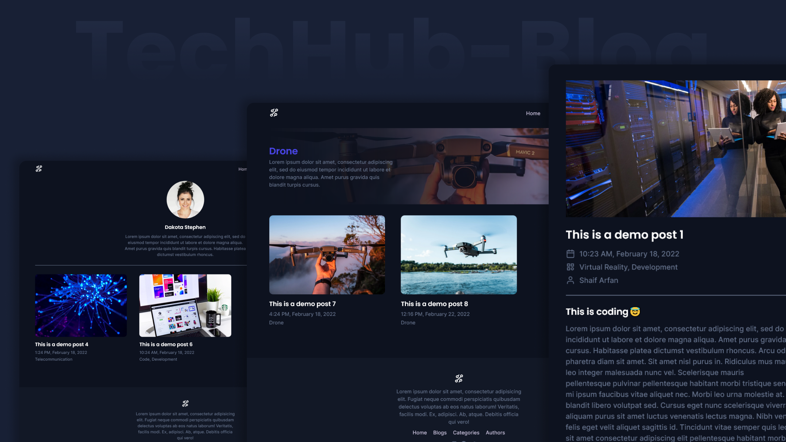

# TechHub-Blog

A complete blog website created with `JAMstack`. ([Gatsby.js](https://www.gatsbyjs.org/) & [Sanity.io](https://sanity.io)).

**Live Preview: [http://techhub-blog.vercel.app/][preview]**

**YouTube Tutorial: [🔗Playlist][project-playlist]**

### Made with ❤️ by [Shaif Arfan][arfan-ig]

Like my works and want to support me?

---

## Project Details

TechHub-blog is a complete tech blog website. Here we will see three post types: `blogs`, `categories`, and `authors`. We will create relations between these three post types. So that we can create a blog post with a category and an author. Also we will make a `search feature` where we can search against all these three post types.

To create this website we will use `JAMstack`. We will use `Gatsby.js` for the frontend and `Sanity.io` for the headless CMS. And to source our content we will use `graphql`.

## What we are going to learn/use

- [React.js](https://reactjs.org/)
- [Gatsby.js](https://www.gatsbyjs.org/)
  - [Gatsby-plugin-image](https://www.gatsbyjs.org/packages/gatsby-plugin-image/)
    - Static Image & Gatsby Image
  - Gatsby Page
    - Normal Pages
    - how to create pages programmatically
  - Gatsby Pagination
  - [Gatsby-plugin-local-search](https://www.gatsbyjs.org/packages/gatsby-plugin-local-search/)
  - [GraphQL](https://graphql.org/)
    - Static Query & Page Query
- [Sanity.io](https://sanity.io/)
  - Sanity Schema
  - Custom Blocks
    - Custom Rich-text Block to Write Blog
    - Custom Code Block
  - Studio Customization
- [React-PortableText](https://github.com/portabletext/react-portabletext)
- [Axios](https://www.npmjs.com/package/axios)
- Many More...

## Requirements

- Basic knowledge of HTML, CSS, and JavaScript
- Experience with React.js

## Starter files

You can find all the starter files in starter-files branch. You can to go to the starter-files branch and download zip the the starter files or You can clone the project and git checkout to starter-files branch.

## Getting Started

You can follow our complete youtube tutorial [Playlist][project-playlist]
or You can clone the project and git checkout to starter-files branch to get started.

## Tools Used

- Images: Unsplash
- UI Design: Figma
- Code Editor: VS Code

## Other projects

📚 [All Web Cifar Projects][wc-projects]

## FAQ

### Q: How can i get started?

You can get started by following the YouTube tutorial of this project. Here is the full tutorial video link: [Playlist][project-playlist].

### Q: I can use this project for my website?

Yes you can. It absolutely free to use.

## Feedback

If you have any feedback, please reach out to us at [@web_cifar][wc-yt]

## Support

For support, join our [Community Group][wc-fb-group].

## License

[MIT][mit]

Happy Coding! ✨🚀

[preview]: http://techhub-blog.vercel.app/
[wc-yt]: http://www.youtube.com/webcifarOfficial
[arfan-ig]: https://www.instagram.com/shaifarfan08/
[wc-projects]: https://github.com/ShaifArfan/wc-project-tutorials
[wc-fb-group]: https://www.facebook.com/groups/webcifar
[mit]: https://choosealicense.com/licenses/mit/
[project-playlist]: https://www.youtube.com/playlist?list=PLRv_Gd5w9e7miD-rZTzTFi8mFSCI5chXI
